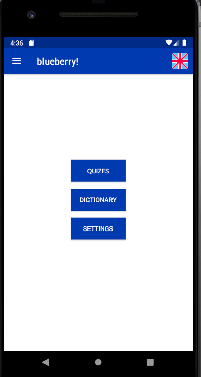
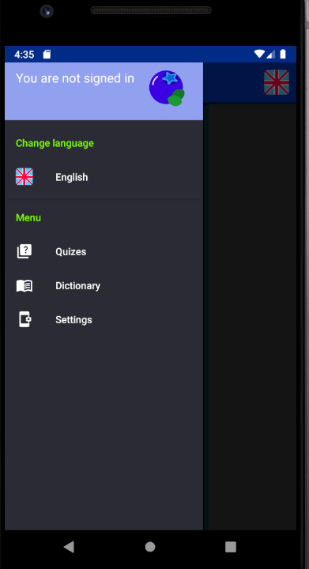
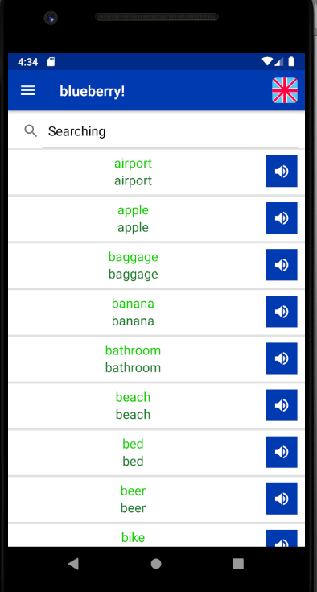

# User manual  

## Usage

!blueberry is a an application which is primarily used to help people (beginners) learn foreign language. The default language of !blueberry is English but there is support for Slovak and Czech when it comes to language settings on the phone. For now, the available language is English. The orientation in the app is pretty straightforward but some of the app's highlight will be discussed below. 

## Features  

### Main Menu

* Quizes contain results of previous taken quizes (can be seen when connected to the Internet) and the user has the possibility to start a new quiz.
* Dictionary contains some words in the foreign language, their translations and recordings of them.
* Settings provide the possibility to generate XML file with stored quiz results or change the theme (light/dark mode).

### Drawer

The look of the drawer in dark mode.

### Dictionary

The dictionary of the app with search window.

### Quiz

How it looks like when the user is taking a quiz. 

## Access old data on new phone

The generated file database.xml (see Settings "Generate and download results" button) is stored in Downloads folder. You need to transfer the file to your new phone. Then when it is in Downloads folder the old data can be accessed and seen in My Scores (see Settings "Synchronize your results" button). Then don't forget to remove the file Downloads folder because when clicking the button later again your new progress will be lost!

## Common problems  

When accesing  the old data in your Downloads folder you need to check both your internal or external storage (when you have inserted SD card) and then move the file to both of them to be sure. It depends on the configuration of the phone manufacturer so in some more complicated situations you will need to have inserted SD card.
Another point important to mention is the fact that when you don't allow !blueberry to access your storage then you will need to do it later manually in the settings.
